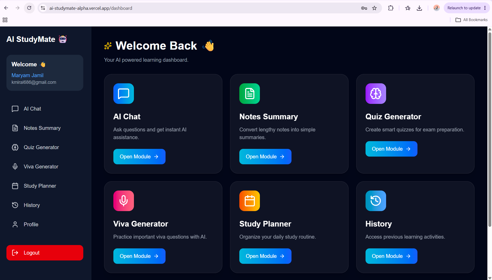

# AI StudyMate 🤖

AI StudyMate is an AI-powered learning assistant that helps students study smarter using Artificial Intelligence.

## 🎯 Problem & Solution

Many students face difficulties in understanding lengthy notes, preparing for exams, creating quizzes, and organizing their study routine.

AI StudyMate solves this problem by providing an AI-powered learning assistant that helps students summarize notes, generate quizzes, practice viva questions, and plan their studies.

## 👥 Target Users

AI StudyMate is designed for:

- University students
- School and college students
- Learners preparing for exams

## 🚀 Features

- 🤖 AI Chat Assistant
- 📝 Notes Summary Generator
- ❓ Quiz Generator
- 🎤 Viva Question Generator
- 📅 Study Planner
- 📜 History Tracking

## 📂 Project Modules

AI StudyMate provides different smart learning tools:

- AI Chat for instant answers
- Notes Summarizer for converting lengthy notes into simple summaries
- Quiz Generator for exam preparation
- Viva Generator for practice questions
- Study Planner for organizing study routine
- History for saving previous activities

## 🤖 AI Features

AI StudyMate uses Artificial Intelligence to provide:

- AI Chat Assistant for answering study-related questions
- Notes Summarizer to convert lengthy notes into simple summaries
- Quiz Generator to create practice questions
- Viva Generator to prepare important viva questions

## 🧠 AI System Instructions

The AI assistant follows these instructions:

"You are an AI Study Assistant. Help students learn concepts clearly, summarize study material, generate quizzes, and provide exam preparation support using simple and understandable language."

## 🛠️ Technologies Used

- Next.js
- React.js
- Tailwind CSS
- Firebase Authentication
- Groq AI
- Vercel Deployment

## 🛠️ Tools & Services

- Next.js (Frontend Framework)
- React.js (UI Development)
- Tailwind CSS (Styling)
- Firebase Authentication (User Management)
- Groq AI (Artificial Intelligence Model)
- Vercel (Deployment)

## ▶️ How to Run Locally

Install dependencies:

```bash
npm install
```

Run the project:

```bash
npm run dev
```

Open in browser:

```bash
http://localhost:3000
```

## 🌐 Live Demo

https://ai-studymate-alpha.vercel.app

## 📸 Screenshots

### Landing Page


### Dashboard


### AI Chat Response


### Notes Summary Output 1


### Notes Summary Output 2
.png)

### Quiz Generator Output


## 👩‍💻 Developer

Maryam Jamil

## 📌 Purpose

AI StudyMate helps students with AI-powered tools for learning, exam preparation, note summarization, quiz generation, viva practice, and study planning.
